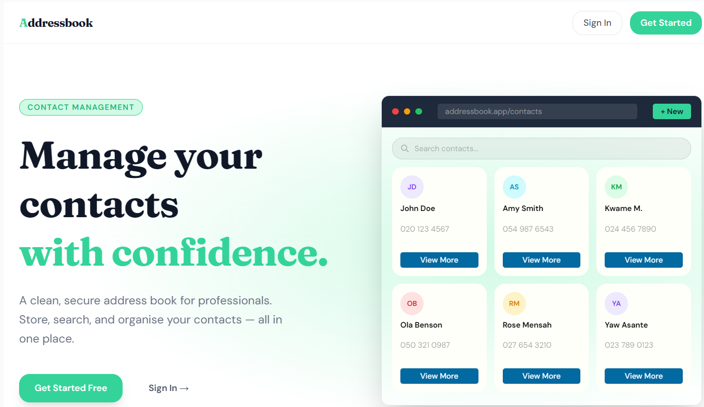
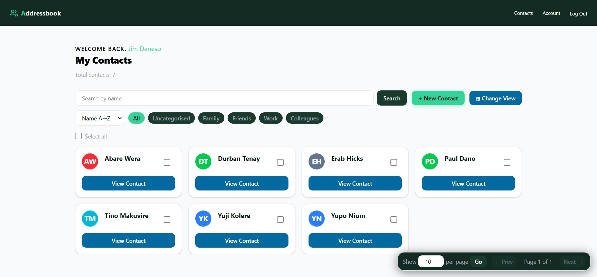
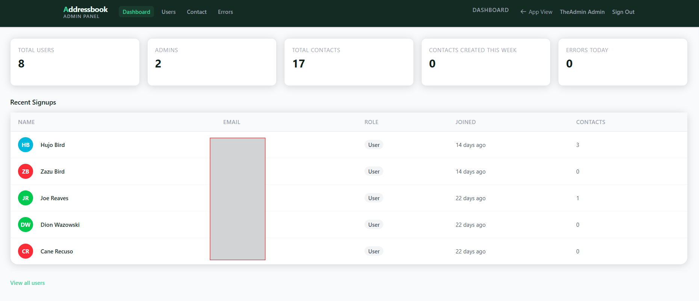

# Rails Addressbok Project - Complete Guide

**Project Type:** Full-stack Rails application  
**Framework:** Rails 8.1

---

## Tech Stack

### Backend

- Ruby 3.4
- Rails 8.1
- PostgreSQL

### Authentication

- Devise

### Frontend

- ERB
- Tailwind CSS

### Gems

- Devise
- Kaminari
- CSV
- Turbo Rails

---

## Table of Contents

1. [Project Overview](#project-overview)
2. [Features List](#features-list)
3. [Setup instructions](#setup-instructions)
4. [Prerequisites](#prerequisites)
5. [Environment Setup](#environment-setup)
6. [Key Commands](#key-commands)
7. [Architecture notes](#architecture-notes)
8. [Roadmap/pending](#roadmap)
9. [Resources](#resources)

---

## Project Overview
> A full-stack Rails application designed to help users manage personal contacts efficiently.

Built with Rails 8, featuring:

- User Accont Management
- CSV import/export
- Admin Panel

### Homepage

<div style="width:100%; margin-bottom: 1rem;">



</div>

### User Dashboard

<div style="width:100%; margin-bottom: 1rem;">



</div>

### Admin Dashboard

<div style="width:100%; margin-bottom: 1rem;">



</div>

## Features List

### General Features

- Authentication with devise
- Contact CRUD operations
- Bulk CSV import and export
- Searching, sorting and filtering
- Role-based access control
- Bulk actions support

### User

1. Create,view,update and delete contacts.
2. Account management

### Admin

#### User Management

1. Create,view,update and delete users.
2. Create administrators
3. Lock and unlock accounts.
4. Promote and demote users.

#### Contacts Management

1. Create,view,update and delete users.
2. View contact ownership

#### Monitoring

1. View application statistics.
2. View advanced user statistics (date joined, number of signups, last sign in, date created).

### Prerequisites

- Ruby 3.4+
- Rails 8.0+
- PostgreSQL 14+
- Node.js 18+
- Bundler 2.x

> **Note**: If you are using Windows, ensure you have **WSL2** (Windows Subsystem for Linux) or Git Bash installed for optimal compatibility.

## Environment setup
### 1. Verify Ruby
```bash
ruby -v
```

Expected
```text
ruby 3.4.x
```
### 2. Verify Rails
```bash
rails -v
```

Expected:
```text
Rails 8.1.x
```

### Verify PostgreSQL
```bash
psql --version
```

Expected:
```text
PostgreSQL 14+
```

## Setup instructions

### 1. Clone the Repository

```bash
git clone <repository-url>
cd addressbook
```

### 2. Install dependencies

```bash
bundle install
```

### 3.Configure Environment variables

Create a .env file in the project root

```bash
touch .env
```

Populate the env with the following variables

```env
ADDRESSBOOK_DATABASE_PASSWORD=password
ADDRESSBOOK_DATABASE_USERNAME=db_username
DEV_DB_NAME=(any db name of your choice)
TEST_DB_NAME=(any db name of your choice)
```
### 4. Create Database
```bash
rails db:create 
```

### 5. Run Migrations 
```bash
rails db:migrate
```

### 6. Seed Database
```bash
rails db:seed
```

### 7. Start Application
```bash
bin/dev
```

Visit:
```url
http://localhost:3000
```
### Default Accounts
The seed creates demo accounts

#### Admin
```text
email = admin@example.com
Firstname = TheAdmin
Lastname = Admin
password = password123
```
#### Users 
__Five users are created in the seed__

```text
email = user2@example.com
firstname = user
lastname = 2
password = user_password_2
```
The other users are users 3 to 6

## Architecture Overview
```text

├───.github
│   └───workflows
├───.kamal
│   └───hooks
├───app
│   ├───assets
│   │   ├───builds
│   │   │   └───tailwind
│   │   ├───images
│   │   ├───stylesheets
│   │   └───tailwind
│   ├───channels
│   │   └───application_cable
│   ├───controllers
│   │   ├───admin
│   │   ├───concerns
│   │   └───users
│   ├───helpers
│   │   └───admin
│   ├───javascript
│   │   └───controllers
│   ├───jobs
│   ├───mailers
│   ├───models
│   │   └───concerns
│   ├───services
│   └───views
│       ├───accounts
│       ├───accounts2
│       ├───admin
│       │   ├───contacts
│       │   ├───dashboard
│       │   ├───error_logs
│       │   ├───shared
│       │   └───users
│       ├───contacts
│       ├───devise
│       │   ├───confirmations
│       │   ├───mailer
│       │   ├───passwords
│       │   ├───registrations
│       │   ├───sessions
│       │   ├───shared
│       │   └───unlocks
│       ├───errors
│       ├───layouts
│       ├───pages
│       ├───passwords
│       ├───passwords_mailer
│       ├───pwa
│       ├───shared
│       └───users
├───bin
├───config
│   ├───environments
│   ├───initializers
│   └───locales
├───db
│   └───migrate
├───lib
│   └───tasks
```

## Database Relationships
### User
```ruby
has_many :contacts
belongs_to :role
``` 

### Contact
```ruby
belongs_to :user
```

### Role
```ruby
has_many :users
```
---

## Authorization Rules
### Standard User
Can: 
- Manage own contacts
- Import contacts
- Export contacts
- Edit profile
- Delete account

Cannot:
- Access admin portal
- Manage other users
- Manage contacts belonging to others

---

### Administrator
Can: 
- Manage all users
- Manage all contacts
- Access admin dashboard
- Lock and unlock accounts
- Change user roles
- View application statistics

---
## Useful Commands
### Start server
```bash
bin/dev
```

### Open Rails console
```bash
bin/rails console
or
bin/rails c
```
### View Routes
```bash
bin/rails routes
or
bin/rails r
```
### Create Migration
```bash
bin/rails generate migration MigrationName
```

### Reset Database
```bash
bin/rails db:reset
```

## Long commit message style

For longer commit messages, use the convention below

Use a short, clear commit message in the format:

    type(scope): short description

Then add an optional body with the what and why, and an optional footer for
issue references or breaking-change notes.

A local commit template file is included at `.gitmessage.txt`.

To enable it for this repository, run:

    git config commit.template .gitmessage.txt

Then run:

    git commit

The template file would open, type your commit message in it.

Example:

    fix(contacts): validate duplicate phone numbers

    Prevent duplicate contact records by validating phone numbers at the model
    level.


## Roadmap 
Planned improvements: 
- Audit Logging
